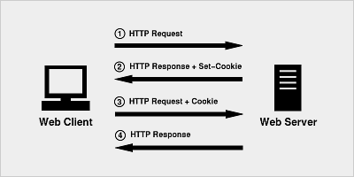

## 会话技术
- http无状态概述
- 状态保持方式概述

## cookie
### cookie原理分析
- 一个cookie的设置以及发送过程分为以下四步
    1. 客户端发送一个http请求到服务器端 
    2. 服务器端发送一个http响应到客户端，其中包含Set-Cookie头部 
    3. 客户端发送一个http请求到服务器端，其中包含Cookie头部 
    4. 服务器端发送一个http响应到客户端 



#### cookie常用属性
- expires 有效期 
- path 路径 
- domain 域名 

### 服务器操作cookie
```php
// 设置cookie
// setcookie(name, value, expire, path, domain);
// 设置1小时后过期
setcookie("user", "lisi", time()+3600);
// 获取单个cookie
echo $_COOKIE["user"];
// 查看所有cookie
print_r($_COOKIE);
```
#### js对cookie基本操作
```javascript
// 设置cookie
function setCookie(key,value,param){
    document.cookie = key + '=' + value + '; expires=' + param.expires + '; path=' + param.path; 
}
// 获取cookie
function getCookie(key){
    var cookies = document.cookie;
    var arr = cookies.split('; ');
    if(arr){
        for (var i = 0; i < arr.length; i++) {
            var kv = arr[i].split('=');
            if(kv[0] == key){
                return kv[1];
            }
        }
    }
}
```
#### jQuery插件操作cookie（jquery.cookie.js）
- cookie插件基本使用
    + 设置单个cookie
    + 获取单个cookie
    + 获取所有cookie
    + 删除单个cookie
- 浏览器中cookie基本设置

## session
### session原理分析
- 客户端第一次请求服务器时，服务器开启一个session，生成一个唯一标识（sessionid：存储的数据与此sessionid关联），并以响应头的Set-Cookie属性响应到客户端
- 客户端的后续请求会一直通过请求头的Cookie属性携带sessionid（客户端与服务器通过此id维持状态）

### session基本操作
- 设置session
```php
session_start();
$_SESSION['user'] = array('username'=>'lisi','age'=>'12');
```
- 读取session
```php
session_start();
$user = $_SESSION['user'];
```
- 删除一个session信息
```php
session_start();
unset($_SESSION['user']);
```
- 删除所有session信息
```php
session_start();
unset($_SESSION);
```
- 销毁session
```php
session_destroy();
```

### session与cookie的关系
- session可以借助cookie实现状态维持，也可以不依赖cookie（URL重写）


| 区别        | cookie        | session          |
| --------- | ------------- | ---------------- |
| 存储位置      | 浏览器           | 服务器              |
| 浏览器携带的数据量 | 多             | 少（只携带session-id） |
| 存储的数据类型   | 只能是字符串        | 任意类型             |
| 安全性       | 较低            | 较高               |
| 默认的有效路径   | 当前路径及其子路径     | 整站有效             |
| 数据的传输量    | 有限制4K，不能超过20个 | 无限制              |

## 基于cookie的案例
- 实现登录功能
- 实现数据列表展示功能
- 通过session验证登录状态
- 通过cookie记住用户名
