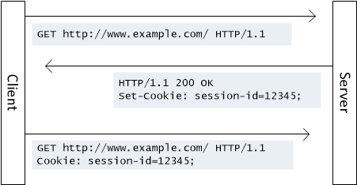
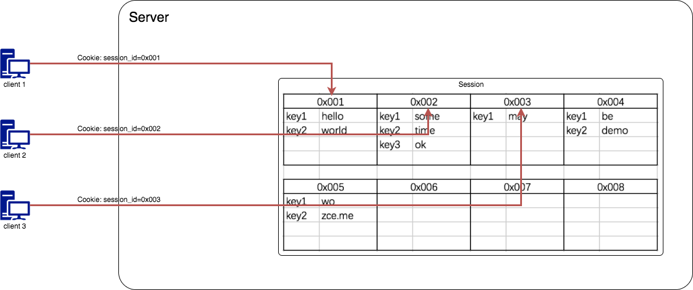

# 管理后台登录

## 处理 HTML 中需要调整的地方

在写静态页面时，我们一般不会关心功能实现过程中对 HTML 的要求，特别是表单一类的 HTML，在实际开发功能时我们一般都会使用到表单的 `action` 和 `method` 属性，还有表单元素的 `name` 属性等等。

这里我们需要调整的有：

1. 给 `form` 表单添加 `action` 和 `method` 属性
2. 给邮箱和密码框添加 `name` 属性
3. 将登录按钮由 `a` 链接改为 `button` 提交按钮

> 🚩 源代码: step-07

---

## 登录业务逻辑

用户第一次访问登录页面（GET），服务端会返回（响应）一个包含登录表单的 HTML 给浏览器。

当用户填写完表单点击登录按钮，浏览器会再发送一个 `POST` 请求到 `login.php` 文件。

我们需要在这个文件中处理 `POST` 请求，`login.php` 文件的处理逻辑大致如下：

```flow
s=>start: 开始
o1=>operation: 用户请求 login.php
c1=>condition: 是否是 POST 请求
c2=>condition: 参数是否完整
o2=>operation: 接收表单参数
o3=>operation: 处理登录逻辑
c3=>condition: 邮箱与密码是否匹配
o4=>operation: 跳转到后台页面
o5=>operation: 输出错误消息
o6=>operation: 渲染登录页面
o7=>operation: 响应 HTML
e=>end: 结束

s->o1->c1
c1(yes)->c2
c2(yes)->o2->o3->c3
c3(yes)->o4->e
c3(no)->o5->o6->o7(left)->e
c2(no)->o5->o6->o7(left)->e
c1(no)->o5->o6->o7(left)->e
```

### 判断是否以 POST 方式请求

在 PHP 脚本**开始执行时**，判断当前请求是否是以 `POST` 方式提交：

```php
<?php
// 判断当前是否是 POST 请求
if ($_SERVER['REQUEST_METHOD'] === 'POST') {
  // TODO: 是 POST 提交
}
...
```

### 参数处理

如果是 POST 提交，则通过 `$_POST` 关联数组获取用户在表单中填写的邮箱和密码。

#### 合法化校验

如果邮箱或者密码没有填写的话，应该提示用户完整填写邮箱和密码，并结束之后的逻辑（没必要执行了）。

```php
if (empty($_POST['email']) || empty($_POST['password'])) {
  // 没有完整填写表单
} else {
  // 完整填写表单...
}
```

#### 错误信息展示

如果执行逻辑过程中出现错误，界面上必须要有一个错误信息的展示，我们的方案就是在出错过后，定义一个错误信息的变量，最后在渲染 HTML 时输出到 HTML 中：

```php
if (empty($_POST['email']) || empty($_POST['password'])) {
  // 没有完整填写表单，定义一个变量存放错误消息，在渲染 HTML 时显示到页面上
  $message = '请完整填写表单';
}
```

> **名词解释**
> 我们把一个变量通过 `echo` 或 `print` 的方式添加到 HTML 指定位置，就叫**输出**

渲染 HTML 时输出：

```php
<?php if (isset($message)) : ?>
<div class="alert alert-danger">
  <strong>错误！</strong><?php echo $message; ?>
</div>
<?php endif; ?>
```

#### 接收参数

```php
$email = $_POST['email'];
$password = $_POST['password'];
```

### 校验邮箱与密码（假数据）

如果邮箱和密码都正确，则跳转到后台页面，反之继续输出当前登录表单 HTML。

```php
...
// 邮箱与密码是否匹配（假数据比对）
if ($email === 'admin@demo.com' && $password === 'wanglei') {
  // 匹配则跳转到 /admin/index.php
  header('Location: /admin/index.php');
  exit; // 结束脚本的执行
} else {
  // 不匹配则提示错误信息
  $message = '邮箱与密码不匹配';
}
```

> 🚩 源代码: step-08

### 表单状态保持

当用户填写错误的邮箱或密码提交过后，再次得到 HTML 页面显示时，除了可以看见错误信息，应该也可以看到之前填写邮箱（非敏感数据）

解决办法也很简单：在输出 `<input>` 时为其添加一个 `value` 属性，值就是 `$_POST['email']`：

```php
<input id="email" name="email" type="email" class="form-control" value="<?php echo isset($_POST['email']) ? $_POST['email'] : ''; ?>" placeholder="邮箱" autofocus>
```

> 提问：为什么不保持密码？

<!-- 答：敏感数据不要保存（不安全） -->

> 🚩 源代码: step-09

---

## 数据库连接查询

> - http://php.net/manual/zh/book.mysqli.php
> - http://www.runoob.com/php/php-ref-mysqli.html

只有数据库才“知道”邮箱与密码是否正确，所以必须通过查询数据库验证邮箱和密码。

### 根据邮箱查询用户

根据邮箱到数据库中查询对应的用户，如果查询不到则代表用户不存在：

```php
// 邮箱与密码是否匹配（数据库查询）
// 建立与数据的连接
$connection = mysqli_connect(DB_HOST, DB_USER, DB_PASS, DB_NAME);

if (!$connection) {
  // 链接数据库失败，打印错误信息，注意：生产环境不能输出具体的错误信息（不安全）
  die('<h1>Connect Error (' . mysqli_connect_errno() . ') ' . mysqli_connect_error() . '</h1>');
}

// 根据邮箱查询用户信息，limit 是为了提高查询效率
$result = mysqli_query($connection, sprintf("select * from users where email = '%s' limit 1", $email));

if ($result) {
  // 查询成功，获取查询结果
  if ($user = mysqli_fetch_assoc($result)) {
    // 用户存在，密码比对
  }
  $message = '邮箱与密码不匹配';
  // 释放资源
  mysqli_free_result($result);
} else {
  // 查询失败
  $message = '邮箱与密码不匹配';
}
// 关闭与数据库之间的连接
mysqli_close($connection);
```

> 提问: 为什么不用邮箱和密码同时去数据库匹配？

<!-- 答：这样就不知道到底是邮箱错误，还是密码错误。 -->

### 用户密码比对

比对用户密码是否与表单提交过来的相同

```php
// 查询成功，获取查询结果
if ($user = mysqli_fetch_assoc($result)) {
  // 用户存在，密码比对
  if ($user['password'] == $password) {
    // 匹配则跳转到 /admin/index.php
    header('Location: /admin/index.php');
    exit; // 结束脚本的执行
  }
}
$message = '邮箱与密码不匹配';
```

> 提问: 为什么不管邮箱或者密码错误都提示“邮箱和密码不匹配”？

<!-- 答：防止恶意尝试登陆。 -->

> 🚩 源代码: step-10

> ✏️ 作业：
> 思考如何实现密码的加密存储，以及为什么要加密？

---

## 访问控制及登陆状态保持

> 名词解释：
> 访问控制，是指我们对特定页面是否允许被访问的判断逻辑。

至此，我们已经完成了登录校验的功能，但是如果我们记住登陆后（约定如此）才可以访问的页面地址，直接在地址栏输入，则可以越过登陆页面的限制直接访问。这样的话登录页形同虚设，没有任何价值。

**解决方法**：在需要访问权控制页面加上访问控制（硬性控制），具体方法就是根据用户之前的登录状态来决定是否可以访问，如果没有登录就不让其访问。

那么问题来了，如何知道用户之前的登录状态？

### Cookie 方案

由于 HTTP 协议本来就是无状态的（每一次见面都是“初次见面”），如果单纯的希望通过我们的程序记住每一个访问者是不可能的，所以必须借助一些手段或者说技巧让服务端记住客户端，这就是 **Cookie**



**Cookie** 就像是在超级市场买东西拿到的小票，由超市（Server）发给消费者（Browser），超市方面不用记住每一个消费者的脸，但是他们认识消费者手里的小票（Cookie），通过小票知道消费者之前的一些消费信息（在服务端产生的数据）。

**我们尝试通过 Cookie 解决以上问题：**

在登录成功过后（在登录提交这一次请求的过程中是知道登录状态的）跳转页面之前，设置当前客户端的 Cookie。

```php
...
// 用户存在，密码比对
if ($user['password'] == $password) {
  // 给用户发一个小票（Cookie），通过 Cookie 保存用户的登录状态
  setcookie('is_logged_in', 'true');
  // 匹配则跳转到 /admin/index.php
  header('Location: /admin/index.php');
  exit; // 结束脚本的执行
}
...
```

> http://php.net/manual/zh/function.setcookie.php

在需要访问控制的页面，判断 Cookie 中是否有登录状态标识。

```php
// 访问控制
if (empty($_COOKIE['is_logged_in'])) {
  // 没有登录标识就代表没有登录
  // 跳转到登录页
  header('Location: /admin/login.php');
  exit; // 结束代码继续执行
}
```

> 🚩 源代码: step-11

### Session 方案

通过 Cookie 方案实现了服务端对客户端登录状态的辨别，但是由于 Cookie 是下发给客户端由客户端本地保存的。换而言之，客户端可以对其随意操作，包括删除和修改。那么如果客户端随意伪造一个 Cookie 的话，对于服务端是无法辨别的，就会造成服务端被蒙蔽，误认为客户端已经登录。

> 演示：伪造 Cookie 登录

于是乎就有了另外一种基于 Cookie 基础之上的手段：**Session**


Session 区别于 Cookie 一个很大的地方就是：Session 数据存在了服务端，而 Cookie 存在了客户端本地，存在服务端最大的优势就是，不是用户想怎么改就怎么改了。



Session 这种机制会更加适合于做登录状态保持，因为客户端不再保存具体的数据，只是保存一把“钥匙”，伪造一把可以用的钥匙，可能性是极低的，所以不需要在意。

> http://php.net/manual/zh/session.examples.basic.php

所以我们将之前使用 Cookie 的地方改为使用 Session：

login.php

```php
// 用户存在，密码比对
if ($user['password'] == $password) {
  // 启用新会话或使用已有会话（打开用户的箱子，如果该用户没有箱子，给他一个新的空箱子）
  session_start();
  // 记住登录状态
  $_SESSION['is_logged_in'] = true;
  // 匹配则跳转到 /admin/index.php
  header('Location: /admin/index.php');
  exit; // 结束脚本的执行
}
```

**注意：`session_start()`**

index.php

```php
// 启动会话
session_start();

// 访问控制
if (empty($_SESSION['is_logged_in'])) {
  // 没有登录标识就代表没有登录
  // 跳转到登录页
  header('Location: /admin/login.php');
  exit; // 结束代码继续执行
}
```

> 🚩 源代码: step-12

<!-- 可选内容：SQL 注入问题 -->

> 开放式讨论：
> 1. login.php 文件到底应该放在哪里？

> 练习：
> 1. 如果不希望在用户登录完成过后再次访问登录页应该如何实现？
> 2. 登陆后跳转到登录前需要访问的页面
