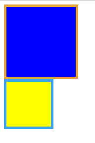

## css3盒子模型

### css2盒子模型与css3盒子模型比较
* 盒子有三个值
    * width： 内容（content）宽度
    * padding：内边距
    * boder：边框
    * 盒子显示在游览器上的实际宽度： width+padding+boder

* CSS3中的box-sizing
    * 在css3中增加了一个box-sizing的属性，将其值设为 boder-sizing，则盒子的宽度永远和width一样
    * 会向内挤压content的空间
    * 默认值是 content-sizing和css2的效果一样

### 示例
```html
<!DOCTYPE html>
<html lang="en">
<head>
    <title></title>
    <meta charset="UTF-8">
    <style type="text/css">
        .content-box{
            box-sizing:content-box;
            -moz-box-sizing:content-box;
            width: 100px;
            height: 100px;
            padding: 20px;
            border: 5px solid #E6A43F;
            background: blue;
        }

        .border-box{
            box-sizing:border-box;
            -moz-box-sizing:border-box;
            width: 100px;
            height: 100px;
            padding: 20px;
            border: 5px solid #3DA3EF;
            background: yellow;
        }
    </style>
</head>
<body>
    <div class="content-box"></div>
    <div class="border-box"></div>
</body>
</html>
```
