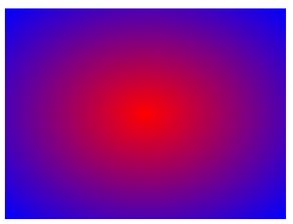
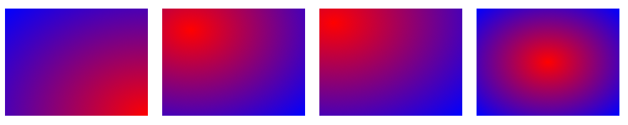
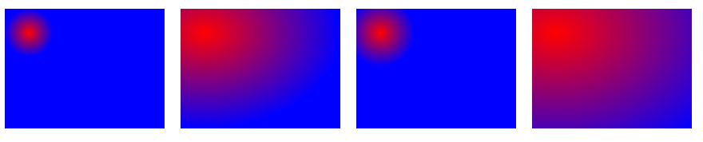
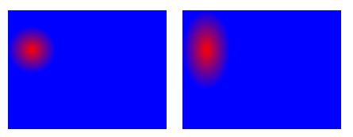

## 渐变

### 介绍
* CSS3 渐变（gradients）可以让你在两个或多个指定的颜色之间显示平稳的颜色过渡。
* 通过使用 CSS3 渐变（gradients）
* 渐变（gradient）是由浏览器生成的， 以前实现类型的效果要使用图片
* CSS3 定义了两种类型的渐变（gradients）：
    * 线性渐变（Linear Gradients）- 向下/向上/向左/向右/对角方向
    * 径向渐变（Radial Gradients）- 由它们的中心定义
* 要想让渐变生效，需要把渐变设给background

### 线性渐变(linear)
1.  默认是从上往下渐变
```css
/*默认是从上往下发生渐变*/
#grad {
  background: linear-gradient(red, blue); /* 标准的语法 */
  background: -webkit-linear-gradient(red, blue); /* Safari 5.1 - 6.0 */
  background: -o-linear-gradient(red, blue); /* Opera 11.1 - 12.0 */
  background: -moz-linear-gradient(red, blue); /* Firefox 3.6 - 15 */
}
```

2. 自定义渐变方向
```css
#grad {
  background: -webkit-linear-gradient(to left top, red , blue); /* Safari 5.1 - 6.0 */
  background: -o-linear-gradient(to bottom right, red, blue); /* Opera 11.1 - 12.0 */
  background: -moz-linear-gradient(to bottom right, red, blue); /* Firefox 3.6 - 15 */
  background: linear-gradient(to bottom right, red , blue); /* 标准的语法 */
}

#grad2 {
  background: -webkit-linear-gradient(80deg, red , blue); /* Safari 5.1 - 6.0 */
  background: -o-linear-gradient(80deg, red, blue); /* Opera 11.1 - 12.0 */
  background: -moz-linear-gradient(80deg, red, blue); /* Firefox 3.6 - 15 */
  background: linear-gradient(80deg, red , blue); /* 标准的语法 */
}
```

3. 重复渐变
```css
#grad {
  /* Safari 5.1 - 6.0 */
  background: -webkit-repeating-linear-gradient(red, yellow 10%, green 20%);
  /* Opera 11.1 - 12.0 */
  background: -o-repeating-linear-gradient(red, yellow 10%, green 20%);
  /* Firefox 3.6 - 15 */
  background: -moz-repeating-linear-gradient(red, yellow 10%, green 20%);
  /* 标准的语法 */
  background: repeating-linear-gradient(red, yellow 10%, green 20%);
  /*
  解释： 起始颜色是red，从起始位置到10%的位置渐变到red， 从10%至20%， 再由yellow渐变到green;此时， 渐变色并没有铺满整个元素，所以会重复平铺以填满元素
  */
}
```

### 径向渐变
* 径向渐变是一个圆形的渐变，由圆心向四周发散的渐变
* 需要设置的参数包括：
    * 颜色（可以设多个）
    * 中心 (at center center)
        * 语法（at x位置 y位置) 都是从左上角原点为参考
        * x, y可以是像素 (at 30px 50px)
        * 可以是百分比 (at 10% 30%)
        * 也可以是top， left， right，center (at left bottom)
        * at center center (默认值， 圆心在盒子的正中心位置)
    * 大小
        * closest-side（最近边）
        * farthest-side（最远边）
        * closest-corner（最近角）
        * farthest-corner（最远角, 默认值）
    * 形状（默认是椭圆
        * elllipse（椭圆，默认值）
        * circle

### 径向渐变演示
1. 颜色演示
```css
<style>
    .box {
        margin: 100px auto;
        width: 400px;
        height: 300px;
        background-color: yellowgreen;
        background: radial-gradient(red, blue);
    }
</style>
```


2. 中心点演示
```css
<style>
    .box {
        margin: 10px;
        width: 200px;
        height: 150px;
        background-color: yellowgreen;
        background: radial-gradient(at right bottom, red, blue);
        float: left;
    }

    .box1 {
        margin: 10px;
        width: 200px;
        height: 150px;
        background-color: yellowgreen;
        background: radial-gradient(at 20% 20%, red, blue);
        float: left;
    }

    .box2 {
        margin: 10px;
        width: 200px;
        height: 150px;
        background-color: yellowgreen;
        background: radial-gradient(at 20px 20px, red, blue);
        float: left
    }

    .box3 {
        margin: 10px;
        width: 200px;
        height: 150px;
        background-color: yellowgreen;
        background: radial-gradient(at center center, red, blue);
        float: left;
    }
</style>
```


3. 大小演示
```css
<style>
    .box {
        margin: 10px;
        width: 200px;
        height: 150px;
        background-color: yellowgreen;
        background: radial-gradient(closest-side at 30px 30px, red, blue);
        float: left;
    }

    .box1 {
        margin: 10px;
        width: 200px;
        height: 150px;
        background-color: yellowgreen;
        background: radial-gradient(farthest-side at 30px 30px, red, blue);
        float: left;
    }

    .box2 {
        margin: 10px;
        width: 200px;
        height: 150px;
        background-color: yellowgreen;
        background: radial-gradient(closest-corner at 30px 30px, red, blue);
        float: left
    }

    .box3 {
        margin: 10px;
        width: 200px;
        height: 150px;
        background-color: yellowgreen;
        background: radial-gradient(farthest-corner at 30px 30px, red, blue);
        float: left;
    }
</style>
```


4. 形状演示
```css
<style>
    .box {
        margin: 10px;
        width: 200px;
        height: 150px;
        background-color: yellowgreen;
        background: radial-gradient(circle closest-side at 30px 50px, red, blue);
        float: left;
    }

    .box1 {
        margin: 10px;
        width: 200px;
        height: 150px;
        background-color: yellowgreen;
        background: radial-gradient(ellipse closest-side at 30px 50px, red, blue);
        float: left;
    }
</style>
```

