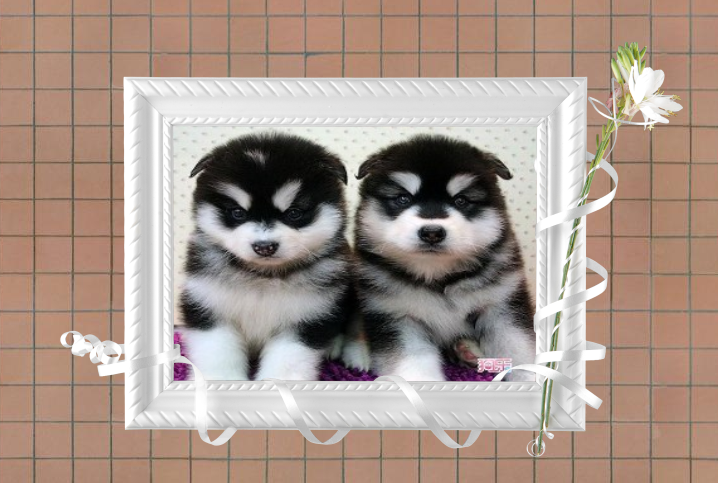

## 背景

### css3中背景的新特性介绍
* c3中增强了背景的设置，可以设置背景的以下内容
    * background-size: 背景的大小
    * background-position: 背景起始显示的位置(x和y方向)
    * 一个盒子可以设多个背景图片

### 背景size设置
* 比如盒子是100 * 100. 背景图片是 200*200. 可以通过设置背景图片的大小，来适应盒子
* background-size
    * auto： 背景图像的真实大小。 
    * cover： 背景图片等比例缩放到铺满盒子
    * contain： 背景图片拉伸以适应盒子大小
    * 直接设置大小 background-size: 100px 100px; 或者backgound-size: 10% 10%;

### 背景位置的设置
* background-position: 背景起始显示的位置(x和y方向),可以有以下几种写法
        * left top, left bottom, right top, right bottom
        * 50% 50%
        * 10px 10px;
* 如果同时设置position和size，复合写法需要用 postion/size 的格式
* 复合写法： `background: url(img/box-sizing.png) left top/100px 100px no-repeat`

### 多张背景的设置
* 多张背景图片设置之间用逗号隔开
```html
<!DOCTYPE html>
<html lang="en">
    <head>
        <title></title>
        <meta charset="UTF-8">
        <style>
             body {
                 background: url(img/wall.jpg);
             }

            .box {
                margin: 100px auto;
                width:623px;
                height: 417px;
                background: 
                url(img/bg1.png) no-repeat left top,
                url(img/bg2.png) no-repeat right top,
                url(img/bg3.png) no-repeat right bottom,
                url(img/bg4.png) no-repeat left bottom,
                url(img/dog3.jpg) no-repeat 113px 85px / 365px 257px;
            }
        </style>
    </head>
    <body>
        <div class="box"></div>
    </body>
</html>

```



