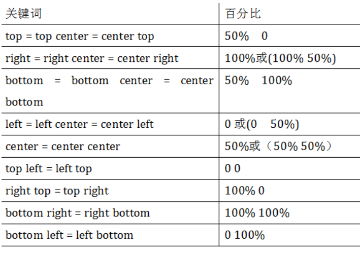
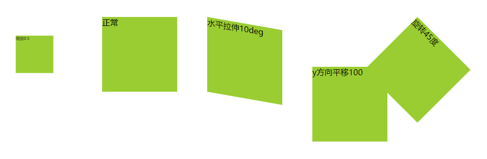

## 变换

### 缩放
* scale()： 指定对象的2D scale（2D缩放）。第一个参数对应X轴，第二个参数对应Y轴。如果第二个参数未提供，则默认取第一个参数的值 
* scalex()： 指定对象X轴的（水平方向）缩放 
* scaley()： 指定对象Y轴的（垂直方向）缩放 
* 以自己的中心点缩放

### 平移
* translate()： 指定对象的2D translation（2D平移）。第一个参数对应X轴，第二个参数对应Y轴。如果第二个参数未提供，则默认值为0 
* translatex()： 指定对象X轴（水平方向）的平移 
* translatey()： 指定对象Y轴（垂直方向）的平移 
* 中心点水平或垂直移动

### 旋转
* rotate()： 指定对象的2D rotation（2D旋转），需先有 <' transform-origin '> 属性的定义 
    
### 变形
* skew()： 指定对象skew transformation（斜切扭曲）。第一个参数对应X轴，第二个参数对应Y轴。如果第二个参数未提供，则默认值为0 
* skewx()： 指定对象X轴的（水平方向）扭曲 
* skewy()： 指定对象Y轴的（垂直方向）扭曲 

### 中心点
* transform-origin： 指定点心点位置
    * 语法： transform-origin: x-axis y-axis z-axis;
    * 值可以设为left right bottom top, 或者百分比，或者像素值
    

### 示例
```html
<!DOCTYPE html>
<html lang="en">
<head>
    <title></title>
    <meta charset="UTF-8">

    <style>
        .box1 {
            float: left;
            width: 150px;
            height: 150px;
            background-color: yellowgreen;
            margin: 30px;
            transform: scale(0.5, 0.5);
        }

        .box2 {
            float: left;
            width: 150px;
            height: 150px;
            background-color: yellowgreen;
            margin: 30px;
        }

        .box3 {
            float: left;
            width: 150px;
            height: 150px;
            background-color: yellowgreen;
            margin: 30px;
            transform-origin: left top;
            transform: skew(0, 10deg);
        }

        .box4 {
            float: left;
            width: 150px;
            height: 150px;
            background-color: yellowgreen;
            margin: 30px;
            transform-origin: left top;
            transform: translateY(100px);
        }

        .box5 {
            float: left;
            width: 150px;
            height: 150px;
            background-color: yellowgreen;
            margin: 30px;
            transform-origin: left top;
            transform: rotate(45deg);
        }
    </style>
</head>
<body>
    <div class="box1">缩放0.5</div>
    <div class="box2">正常</div>
    <div class="box3">水平拉伸10deg</div>
    <div class="box4">y方向平移100</div>
    <div class="box5">旋转45度</div>
</body>
</html>
```



