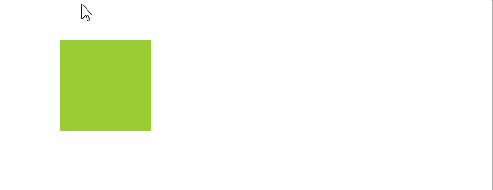

## 动画

### 动画的介绍
* 用`@keyframes 动画名 {}`定义一个动画
* 该动画可以被多个元素重复使用

### 动画的定义及使用 
* 简单示例
```html
<!DOCTYPE html>
<html lang="en">
<head>
    <title></title>
    <meta charset="UTF-8">
    <style>
        .box {
            margin: 100px;
            width: 100px;
            height: 100px;
            background-color: yellowgreen;
            transform: translateX(0px);

            animation: boxAnimation 1s;
        }

        @keyframes boxAnimation {
            form {

            }

            to {
                transform: translateX(300px);
            }
        }
    </style>
</head>
<body>
    <div class="box"></div>
</body>
</html>
```



### 动画的属性介绍
* animation-name：动画名称 
* animation-duration：动画的持续时间
* animation-timing-function： 动画的过渡类型 
    * linear： 线性过渡。等同于贝塞尔曲线(0.0, 0.0, 1.0, 1.0) 
    * ease： 平滑过渡。等同于贝塞尔曲线(0.25, 0.1, 0.25, 1.0) 
    * ease-in： 由慢到快。等同于贝塞尔曲线(0.42, 0, 1.0, 1.0) 
    * ease-out： 由快到慢。等同于贝塞尔曲线(0, 0, 0.58, 1.0) 
    * ease-in-out： 由慢到快再到慢。等同于贝塞尔曲线(0.42, 0, 0.58, 1.0) 
    * step-start： 等同于 steps(1, start) 
    * step-end： 等同于 steps(1, end) 
    * steps(<integer>[, [ start | end ] ]?)： 接受两个参数的步进函数。第一个参数必须为正整数，指定函数的步数。第二个参数取值可以是start或end，指定每一步的值发生变化的时间点。第二个参数是可选的，默认值为end。 
    * cubic-bezier(<number>, <number>, <number>, <number>)： 特定的贝塞尔曲线类型，4个数值需在[0, 1]区间内 
* animation-delay： 动画延迟的时间 
* animation-iteration-count： 动画的循环次数 
* animation-direction： 动画是否反向运动 
    * normal： 正常方向 
    * reverse： 反方向运行, 从动画结束状态运行到动画开始状态 
    * alternate： 动画先正常运行再反方向运行，并持续交替运行 
    * alternate-reverse： 动画先反运行再正方向运行，并持续交替运行
* animation-fill-mode： 动画结束状态
    * none： 结束还原
    * forwards： 保存结束时状态
    * backwards： 动画等待时，使用0%时的样式，结束后还原
    * both：动画等待时，使用0%时的样式， 结速后保持最后一帧的样式
* animation: 复合写法
    * anmatiton： boxAnimation 1s linear 2s 10 reverse forwards;
    * 解释： 延迟两秒(2s)， 匀速(linerar) 反方向(reverse) 执行 boxAnimation 动画， 时长为1秒(1s)， 重复10次(10)。
