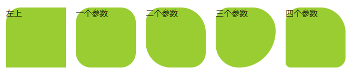
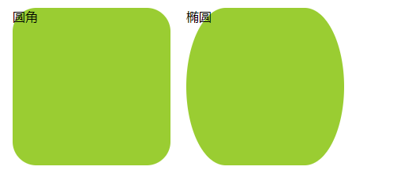

##  圆解-borderRadius

### border-radius简介
* border-radius可以设置盒子的棱角角为圆角
* 圆角的形成原理，其实是圆或者椭圆与盒子内切形成的
* 语法： border-radius: none　｜　length{1,4} [/ length{1,4} 

### border-radius 参数的写法
* 单独设置四个圆角
    * border-top-left-radius: //左上角 
    * border-top-right-radius: //右上角 
    * border-bottom-right-radius: //右下角 
    * border-bottom-left-radius: //左下角 
* 所有圆角合在一起设置
    *  border-radius;
    * 用空格隔开
    * 只写一个参数： 对四个角都生效
    * 只写两个参数： 第一个参数对左上和右下角生效， 第二个参数对右上和左下角生效
    * 只写三个参数： 第一个参数对左上角生效， 第二个参数对右上和左下角生效， 第三个参数对右下角生效
    * 写四个参数： 分别对左上， 右上， 右下， 左下角生效
* 示例
```css
<style>
    .box1 {
        margin: 10px;
        float: left;
        border-top-left-radius: 30px;
        width: 120px;
        height: 120px;
        background-color: yellowgreen;
    }

    .box2 {
        margin: 10px;
        float: left;
        border-radius: 30px;
        width: 120px;
        height: 120px;
        background-color: yellowgreen;
    }

    .box3 {
        margin: 10px;
        float: left;
        border-radius: 30px 50px;
        width: 120px;
        height: 120px;
        background-color: yellowgreen;
    }

    .box4 {
        margin: 10px;
        float: left;
        border-radius: 30px 50px 80px;
        width: 120px;
        height: 120px;
        background-color: yellowgreen;
    }

    .box5 {
        margin: 10px;
        float: left;
        border-radius: 30px 50px 20px 10px;
        width: 120px;
        height: 120px;
        background-color: yellowgreen;
    }
</style>
```


### border-radius 圆角与椭圆角
* 圆角示例 bordr-radius: 20px 25px 30px 40px, 表示左上， 右上， 右下，左上四个角的圆弧半径
* 椭圆示例 bordr-radius: 20px 25px 30px 40px/31px 32px 33px 34px;表示左右圆的椭圆半径为（x:20, y:32）, 右上：（x:20, y:32），右下： （x:20, y:32）， 左上： （x:20, y:32）
* 如果只设一个角，x与y值为空格隔开： border-top-left-radius: 30px 60px;

* 示例
```css
<style>
    .box1 {
        margin: 10px;
        float: left;
        border-radius: 30px/30px;
        width: 200px;
        height: 200px;
        background-color: yellowgreen;
    }

    .box2 {
        margin: 10px;
        float: left;
        border-radius: 50px/100px;
        width: 200px;
        height: 200px;
        background-color: yellowgreen;
    }
</style>
```


