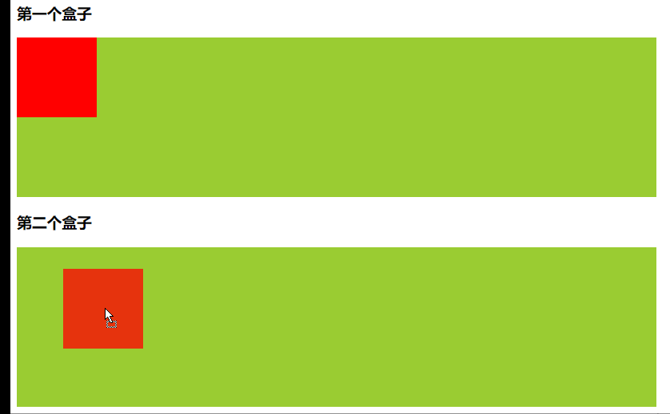

## 拖拽

### 拖拽事件
* 要想让一个元素可以被拖拽，需要设置其 draggable="true"
* 被拖拽的子元素，可以实现以下事件：
    * ondragstart： 拖拽开始
    * ondrag：拖拽中
    * ondragend： 拖拽结束
    * ondragleave： 离开父盒子
    * ondrop: 松手

* 对被拖入子元素的父盒子
    * ondragover： 经过父盒子
    * ondragenter： 进入父盒子
### 示例
* 将红色方块从第一个盒子移入第二个盒子中
```html
<!DOCTYPE html>
<html lang="en">
<head>
    <title></title>
    <meta charset="UTF-8">

    <style>
        .box1, .box2 {
            width: 800px;
            height: 200px;
            background-color: yellowgreen;
        }

        .littleBox {
            width: 100px;
            height: 100px;
            background-color: red;
        }
    </style>
</head>
<body>
    <h3>第一个盒子</h3>
    <div class="box1">
        <div class="littleBox" draggable="true"></div>
    </div>
    <h3>第二个盒子</h3>
    <div class="box2"></div>
</body>
</html>

<script>
     var littleBox = document.querySelector(".littleBox");
     var beginBox = document.querySelector(".box1");
     var endBox = document.querySelector(".box2");

     //开始拖拽
     littleBox.ondragstart = function () {
         console.log("开始拖拽");
     }

     //拖拽中
     littleBox.ondrag = function () {
         console.log("正在拖拽");
     }

     //拖拽结束
     littleBox.ondragend = function () {
         console.log("结束拖拽");
     }

     //离开父盒子
     littleBox.ondragleave = function () {
         console.log("离开父盒子");
     }

     //为下面的盒子绑定拖入事件
     //默认是不允许拖入的， 修改默认值
     endBox.ondragover = function (event) {
         //阻止默认行为
         event.preventDefault();
     }

     endBox.ondragenter = function () {
         console.log("进入");
     }

     endBox.ondrop = function () {
         console.log("松手");
         this.appendChild(littleBox);
     }

</script>
```

