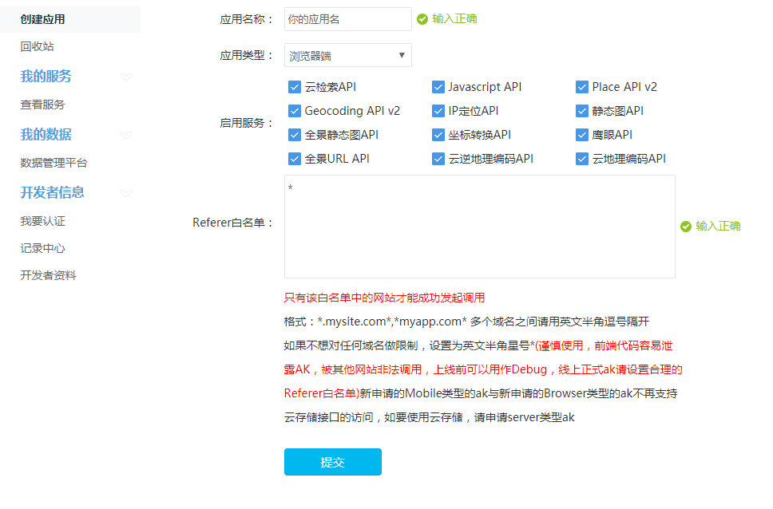

## 地图

### 获取经纬度
* 必须打开定位
* chrome获取不到，因为google的被墙掉了，使用ie可以获取到
* 由于获取定位是一个耗时操作，所以，需要在回调函数中实现
* 在电脑上获取的不是很准确，在手机上比较准确
* 可以使用百度地图
* 手机定位比较准确的

### 使用html的api获取经伟度
* 直接调用window的api即可
```js
window.navigator.geolocation.getCurrentPosition(function (position) {
    console.log(position);
    alert('亲爱的用户,你所处的位置 经度是:'+position.coords.longitude+'所处的维度是:'+position.coords.latitude)
})
```

### 使用百度地图
* 地址： http://lbsyun.baidu.com/index.php?title=jspopular
* 必须要有一个密钥

* 参考示例demo即可： http://lbsyun.baidu.com/jsdemo.htm?a#a1_2
