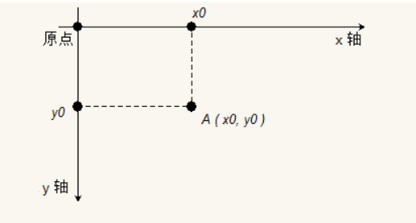
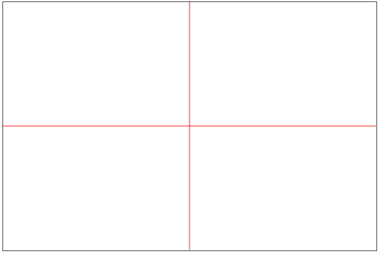

## canvas 基础

### canvas介绍
1. canvas是什么
    * `<canvas>`是一个可以使用JavaScript, 在其中绘制图形的 HTML5 元素， canvas 原意画布, 帆布. 在 HTML 页面中用于展示绘图效果. 最早 canvas 是苹果提出的一个方案, 今天已经在大多数浏览器中实现.
    * `canvas 英 ['kænvəs]  美 ['kænvəs]   帆布 画布`

2. canvas能干什么
    * 绘图(图标，图形的绘制)
    * 数据的可视化(重点)
    * 动画与游戏（flash死于2017）
    * banner 广告
    * 多媒体、虚拟现实、图形编辑等

        

3. 我们的学习目标
    * 初级：绘制简单的图形（线，矩形，折线图，圆柱，矩形）
    * 中级：绘制文字和图片
    * 高级：变形和动画
    * 实战：时钟、笨鸟仿真游戏开发
    
### canvas初体验
1. Canvas 的默认大小为300像素×150像素（宽×高，像素的单位是px）。但是，可以使用HTML的高度和宽度属性来自定义Canvas 的尺寸。Canvas是一个画布（图片），不要使用css来设置宽高，否则该画布将会被拉升变形

2. cavns的坐标与原点

    

3. Demo

    ```html
    <!DOCTYPE html>
    <html>
    <head lang="en">
        <meta charset="UTF-8">
        <title></title>
        <style>
            #c {
                border: 1px solid #000;
            }
        </style>
    </head>

    <body>
    <canvas id="c" width="600", height="300"></canvas>

    <script>
        //1. 准备画布
        var canvas = document.querySelector("#c");
        //2. 生成画图工具（请画家)
        var ctx = canvas.getContext("2d");
        //注意，画图工具先生成路径（就像当于生成复印纸）
        //3. 开始画线
        //将画笔移动到某个坐标点
        ctx.moveTo(0, 150);
        //画一条水平直线
        ctx.lineTo(600, 150);
        //画一条垂直直线
        ctx.moveTo(300, 0);
        ctx.lineTo(300, 300);
        //4. 线条颜色填充
        ctx.stroke();
    </script>
    </body>
    </html>
    ```

    

### 检查canvas的兼容性
1. canva兼容性的问题
    * canvas 的兼容性非常强, 只要支持该标签的, 基本功能都一样, 因此不用考虑兼容性问题.
    * canvas 本身就是一张画布. 整个绘图过程是由 JavaScript 来完成， canvas 对象提供了各种绘图用的 api.
    * 如果浏览器不支持 canvas 标签, 那么就会将其解释为 div 标签. 因此常常在 canvas 中嵌入文本, 以提示用户浏览器的能力.

2. 代码

    ```js
    var canvas = document.getElementById('tutorial');
    if (canvas.getContext){
        var ctx = canvas.getContext('2d');
        // 开始画图
    } else {
        // canvas不支持提示
    }
    ```  


