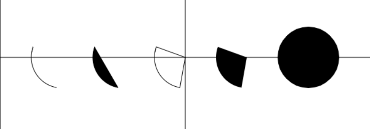

## 绘制基本形状

### 画直线
1. 获取canvas，画布
2. 生成ctx(画图工具)
3. ctx.moveTo(x, y): 将画笔移动到某个坐标点上
4. ctx.lineTo(x, y), 从画笔所在的点，移动到当前点，即画出一条直接
5. ctx.stroke(),给画的线设置颜色

    ```js
    var canvas = document.getElementById("canvas");
    var ctx = canvas.getContext("2d");

    //画两条中心参考线
    ctx.moveTo(0, 52);
    ctx.lineTo(600, 52);
    ctx.moveTo(50, 0);
    ctx.lineTo(50, 400);
    ctx.stroke();
    ```

### 用直线连接形状

* 画一个三角形，并填充颜色
    ```js
    var canvas = document.getElementById("canvas");
    var ctx = canvas.getContext("2d");
    ctx.strokeStyle = "rgba(255, 100, 100, 0.5)";

    ctx.moveTo(100, 100);
    ctx.lineTo(200, 100);
    ctx.lineTo(200, 300);
    ctx.closePath();
    ctx.stroke();
    ctx.fill();

    //开启新的路径
    ctx.beginPath();
    //画一条线
    ctx.moveTo(300, 100);
    ctx.lineTo(300, 400);
    ctx.stroke();
    ```

* 路径
    * 我们可以这样想象：ctx在画图时，并不是直接把线画到画布上，而是画在玻璃纸上
    * 当执行stroke时，把玻璃纸向画布上做一次印刷，再执行一次stoke会再印刷一次
    * 为了避免重复印刷，我们的做法是， 再拿一张新的玻璃纸，在新的玻璃纸上绘制
    * 再次执行stroke就会使用新玻璃纸上的图形
    * beginPath， 创建一个新玻璃纸的过程， 叫做, 路径就是玻璃纸上的图形元素；
    * closePath，会自动将lineTo的最后一个点和最近的moveTo点连接起来， 

* stroke()和fill()
    * stroke是描边，（素描）
    * fill是填充，（上色）
    * fill会自动执行一次closePath
* strokeStyle和fillStyle
    * strokeStyle，描边颜色
    * fillStyle, 填充颜色

### 画矩形

1. 画矩形有三种方式：
    1. 用线条连成一个矩形；
    2. 使用ctx.rect()方法；
    3. 使用ctx.fillRect()方法。第三种方法会重新开启一个新的路径

1. 用线条连成一个矩形
    ```js
    //1. 第一种方式，画线
    ctx.beginPath()
    ctx.moveTo(10, 10);
    ctx.lineTo(110, 10);
    ctx.lineTo(110, 110);
    ctx.lineTo(10, 110);
    ctx.closePath();
    ctx.stroke();
    ```

2. 第二种方式
    ```js
    ctx.beginPath()
    ctx.rect(120, 10, 100, 100);
    ctx.stroke();
    ```
3. 第三种方式
    ```js
    //这种方式会重新开启一个path
    ctx.fillRect(230, 10, 100, 100);
    ```

### 画弧形、扇形和圆

1. `arc(x, y, radius, startAngle, endAngle, anticlockwise)`, 画一个以（x,y）为圆心的以`radius`为半径的圆弧（圆），从`startAngle`开始到`endAngle`结束，按照`anticlockwise`给定的方向（默认为顺时针）来生成。
2. 注意，在canvas中，所有的角度都必须转成弧度才能使用，角度转弧度公式`angle/180*Math.PI`

3. 实现以下效果

    
4. 代码
    ```js
    <script>
        var canvas = document.getElementById("canvas");
        var ctx = canvas.getContext("2d");

        //画两条中心参考线
        ctx.moveTo(0, 200);
        ctx.lineTo(600, 200);
        ctx.moveTo(300, 0);
        ctx.lineTo(300, 400);
        ctx.stroke();
        ctx.beginPath();

        //画圆弧
        ctx.arc(100, 200, 50, 100/180*Math.PI, 200/180*Math.PI);
        ctx.stroke();

        ctx.beginPath();
        ctx.arc(200, 200, 50, 100/180*Math.PI, 200/180*Math.PI);
        ctx.stroke();
        ctx.fill();

        ctx.beginPath();
        ctx.arc(300, 200, 50, 100/180*Math.PI, 200/180*Math.PI);
        ctx.lineTo(300, 200);
        ctx.closePath();
        ctx.stroke();

        ctx.beginPath();
        ctx.arc(400, 200, 50, 100/180*Math.PI, 200/180*Math.PI);
        ctx.lineTo(400, 200);
        ctx.fill();

        ctx.beginPath();
        ctx.arc(500, 200, 50, 0/180*Math.PI, 360/180*Math.PI);
        ctx.lineTo(500, 200);
        ctx.fill();
    </script>
    ```
    
### 示例

1. 折线图
2. 柱状图
3. 饼状图
> (参考上课代码)
