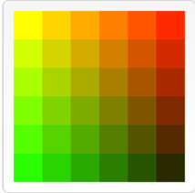
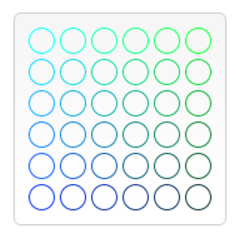
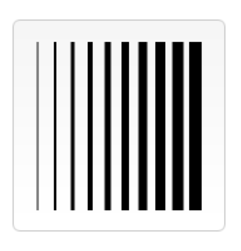
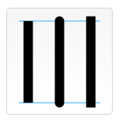
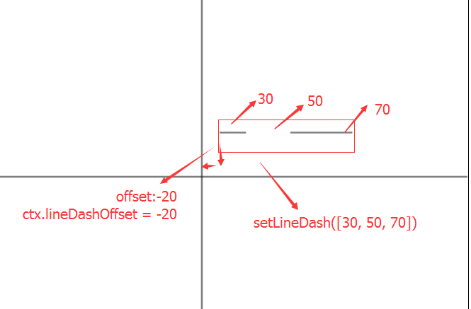
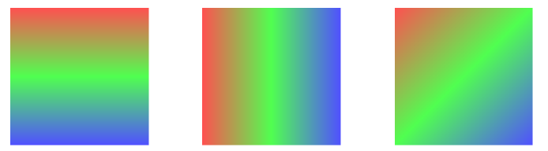
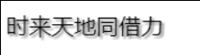

## 色彩 Colors

如果我们想要给图形上色，有两个重要的属性可以做到：`fillStyle` 和 `strokeStyle`。

* fillStyle = color：设置图形的填充颜色。
* strokeStyle = color：设置图形轮廓的颜色。
* color 可以是表示 CSS 颜色值的字符串，渐变对象或者图案对象。我们迟些再回头探讨渐变和图案对象。默认情况下，线条和填充颜色都是黑色（CSS 颜色值 #000000）。

    > 注意: 一旦您设置了 strokeStyle 或者 fillStyle 的值，那么这个新值就会成为新绘制的图形的默认值。如果你要给每个图形上不同的颜色，你需要重新设置 fillStyle 或 strokeStyle 的值。

* 您输入的应该是符合 CSS3 颜色值标准 的有效字符串。下面的例子都表示同一种颜色。

    ```css
    // 这些 fillStyle 的值均为 '橙色'
    ctx.fillStyle = "orange";
    ctx.fillStyle = "#FFA500";
    ctx.fillStyle = "rgb(255,165,0)";
    ctx.fillStyle = "rgba(255,165,0,1)";
    ```

### fillStyle示例

* 在本示例里，我们用两层 for 循环来绘制方格阵列，每个方格不同的颜色。结果如右图，但实现所用的代码却没那么绚丽。我用了两个变量 i 和 j 来为每一个方格产生唯一的 RGB 色彩值，其中仅修改红色和绿色通道的值，而保持蓝色通道的值不变。你可以通过修改这些颜色通道的值来产生各种各样的色板。通过增加渐变的频率，你还可以绘制出类似 Photoshop 里面的那样的调色板。

    ```js
    function draw() {
    var ctx = document.getElementById('canvas').getContext('2d');
    for (var i=0;i<6;i++){
        for (var j=0;j<6;j++){
        ctx.fillStyle = 'rgb(' + Math.floor(255-42.5*i) + ',' + 
                        Math.floor(255-42.5*j) + ',0)';
        ctx.fillRect(j*25,i*25,25,25);
        }
    }
    }
    ```
    

### strokeStyle 示例

* 这个示例与上面的有点类似，但这次用到的是 strokeStyle 属性，画的不是方格，而是用 arc 方法来画圆

    ```js
    function draw() {
        var ctx = document.getElementById('canvas').getContext('2d');
        for (var i=0;i<6;i++){
        for (var j=0;j<6;j++){
            ctx.strokeStyle = 'rgb(0,' + Math.floor(255-42.5*i) + ',' + 
                            Math.floor(255-42.5*j) + ')';
            ctx.beginPath();
            ctx.arc(12.5+j*25,12.5+i*25,10,0,Math.PI*2,true);
            ctx.stroke();
        }
        }
    }
    ```

    

### 线条

**可以通过以下属性来设置线条**  

* lineWidth = value: 设置线条宽度。
    ```js
    function draw() {
    var ctx = document.getElementById('canvas').getContext('2d');
    for (var i = 0; i < 10; i++){
        ctx.lineWidth = 1+i;
        ctx.beginPath();
        ctx.moveTo(5+i*14,5);
        ctx.lineTo(5+i*14,140);
        ctx.stroke();
    }
    }
    ```
    

* lineCap = type: 设置线条末端样式。

    ```js
    function draw() {
    var ctx = document.getElementById('canvas').getContext('2d');
    var lineCap = ['butt','round','square'];

    // 创建路径
    ctx.strokeStyle = '#09f';
    ctx.beginPath();
    ctx.moveTo(10,10);
    ctx.lineTo(140,10);
    ctx.moveTo(10,140);
    ctx.lineTo(140,140);
    ctx.stroke();

    // 画线条
    ctx.strokeStyle = 'black';
    for (var i=0;i<lineCap.length;i++){
        ctx.lineWidth = 15;
        ctx.lineCap = lineCap[i];
        ctx.beginPath();
        ctx.moveTo(25+i*50,10);
        ctx.lineTo(25+i*50,140);
        ctx.stroke();
    }
    ```
    

* getLineDash(): 返回一个包含当前虚线样式，长度为非负偶数的数组。
* setLineDash(segments): 设置当前虚线样式。
* lineDashOffset = value: 设置虚线样式的起始偏移量。

* 代码

    ```js
    ctx.setLineDash([30, 50, 70]);
    ctx.lineDashOffset = -20;
    ctx.moveTo(300, 150);
    ctx.lineTo(500, 150);
    ctx.stroke();
    ```

    

### 渐变（画一条彩虹）

* 所谓渐变，是指从开始地点到结束地点，颜色呈直线的徐徐变化的效果。为了实现这种效果，我们绘制时必须制定开始和结束的颜色。而在Canvas中，不仅可以只指定开始和结尾的两点，中途的位置也能任意指定，所以可以实现各种奇妙的效果。  
* 为了绘制线性渐变，我们需要使用`createLinearGradient`命令，这个命令可以获得一个`CanvasGradient`对象，使用这个对象的`addColorStop`方法添加颜色，就可以了。

* CanvasGradient = ctx.createLinearGradient(x0, y0, x1, y1)
    渐变的开始地点(x0, y0)，结束地点(x1, y1)指定后，返回线性渐变对象CanvasGradient。
    然后我们通过addColorStop方法，offset为0的地方为开始地点的颜色，offset为1的则为结束地点的颜色。另外，很明显的，x0=x1并且y0=y1的时候，不会有渐变效果出现。
 
* CanvasGradient.addColorStop(offset, color)
    这个方法就是增加点的颜色，如果offset大于1或者小于0，会发生INDEX_SIZE_

* 整个的使用方法，首先是利用createLinearGradient方法指定渐变的首末位置得到CanvasGradient对象，再对这个对象使用addColorStop方法指定各个位置的颜色。最后，将CanvasGradient对象作为fillStyle使用。当然如果是希望框线使用渐变，就将其设置到strokeStyle上去

* 示例代码（分别实现下图的效果）

    

* 垂直方向的渐变
    ```js
    var ctx = canvas.getContext('2d');
    ctx.beginPath();
    /* 指定渐变区域 */
    var grad  = ctx.createLinearGradient(0,0, 0,140);
    /* 指定几个颜色 */
    grad.addColorStop(0,'rgb(192, 80, 77)');    // 红
    grad.addColorStop(0.5,'rgb(155, 187, 89)'); // 绿
    grad.addColorStop(1,'rgb(128, 100, 162)');  // 紫
    /* 将这个渐变设置为fillStyle */
    ctx.fillStyle = grad;
    /* 绘制矩形 */
    ctx.rect(0,0, 140,140);
    ctx.fill();
    // ctx.fillRect(0,0, 140,140);
    ```
    > 如果不填充，只是描边渐变，就修改`ctx.strokeStyle = grad`

* 水平方向的渐变

    * 有了上面的基础，这个就非常简单了，只需要修改一句话就好了：

    ```js
    var grad = ctx.createLinearGradient(0,0,140,0);
    ```

* 倾斜的线性渐变

    * 有了垂直方向和水平方向，也就一个倾斜的可以玩玩了，和上面一样，只是指定一下方向就可以了：

    ```js
    var grad = ctx.createLinearGradient(0, 0, 140, 140);
    ```

### 阴影

* shadowOffsetX: shadowOffsetX 和 shadowOffsetY 用来设定阴影在 X 和 Y 轴的延伸距离，负值表示阴影会往上或左延伸，正值则表示会往下或右延伸，它们默认都为 0。
* shadowOffsetY: shadowOffsetX 和 shadowOffsetY 用来设定阴影在 X 和 Y 轴的延伸距离，它们是不受变换矩阵所影响的。负值表示阴影会往上或左延伸，正值则表示会往下或右延伸，它们默认都为 0。
* shadowBlur: shadowBlur 用于设定阴影的模糊程度，其数值并不跟像素数量挂钩，也不受变换矩阵的影响，默认为 0。
* shadowColor: shadowColor 是标准的 CSS 颜色值，用于设定阴影颜色效果，默认是全透明的黑色。

* 代码示例

    ```js
    function draw() {
    var ctx = document.getElementById('canvas').getContext('2d');

    ctx.shadowOffsetX = 2;
    ctx.shadowOffsetY = 2;
    ctx.shadowBlur = 2;
    ctx.shadowColor = "rgba(0, 0, 0, 0.5)";
    
    ctx.font = "20px 微软雅黑";
    ctx.fillStyle = "Black";
    ctx.fillText("时来天地同借力", 5, 30);
    }
    ```

    

### save()和stroke()

1. sava()方法可以用来保存ctx的相关设置；
2. restore()方法用来恢复ctx工具的样式;

