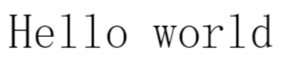
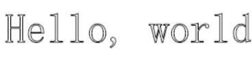
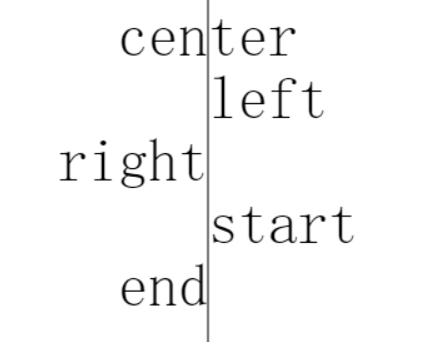
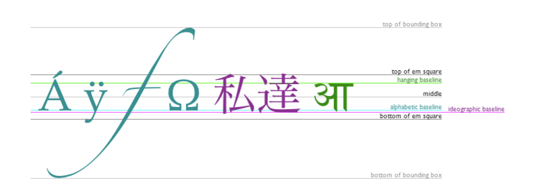

## 绘制文本

### 文本绘制的方式

canvas 提供了两种方法来渲染文本:

1. fillText(text, x, y [, maxWidth])
在指定的(x,y)位置填充指定的文本，绘制的最大宽度是可选的.

2. strokeText(text, x, y [, maxWidth])
在指定的(x,y)位置绘制文本边框，绘制的最大宽度是可选的.

3. 一个填充文本的示例

    ```js
    function draw() {
    var ctx = document.getElementById('canvas').getContext('2d');
    ctx.font = "48px serif";
    ctx.fillText("Hello world", 10, 50);
    }
    ```

    

4. 一个文本边框的示例

    ```js
    function draw() {
    var ctx = document.getElementById('canvas').getContext('2d');
    ctx.font = "48px serif";
    ctx.strokeText("Hello world", 10, 50);
    }
    ```
    

### 设置文本样式

以下属性的设置和css设置一样
1. font = value: 当前我们用来绘制文本的样式. 这个字符串使用和 CSS font 属性相同的语法. 默认的字体是 10px sans-serif。
2. textAlign = value: 文本对齐选项. 可选的值包括：start, end, left, right or center. 默认值是 start。

    

3. textBaseline = value: 基线对齐选项. 可选的值包括：top, hanging, middle, alphabetic, ideographic, bottom。默认值是 alphabetic。

    
4. direction = value: 文本方向。可能的值包括：ltr, rtl, inherit。默认值是 inherit。


### 计算文本大小

* measureText()： 返回一个 TextMetrics对象的宽度、所在像素
    ```js
    function draw() {
    var ctx = document.getElementById('canvas').getContext('2d');
    var text = ctx.measureText("foo"); // TextMetrics object
    text.width; // 16;
    }
    ```