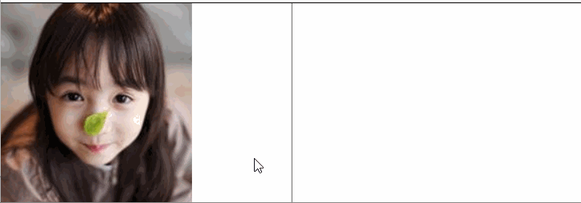

## canvas 绘制图象

### 准备图片

1. 浏览器支持的任意格式的外部图片都可以被直接绘制到画布上，比如PNG、GIF或者JPEG。 
2. 绘图需要两步：
    1. 获取一个图片对象
    2. 使用drawImage()方法将图片画到canvas上

3. 获得需要绘制的图片, canvas的API可以使用下面这些类型中的一种作为图片的源：
    * HTMLImageElement: new Image()，或者任何的元素
    * HTMLVideoElement: 用一个HTML的 \<video\>视频中抓取当前帧作为一个图像
    * HTMLCanvasElement：可以使用另一个 \<canvas\> 元素作为你的图像。

4. 创建并加载图片代码示例

    ```js
    var img = new Image();   // 创建一个元素
    img.src = 'myImage.png'; // 设置图片源地址

    img.onload = function(){
    // 执行drawImage语句
    ctx.drawImage(img);
    }
    ```

    > 若调用 drawImage 时，图片必须加载完成，因此应该在image的onload事件中，执行绘制方法

### 绘制图片

1. 直接从原点绘制: `drawImage(image, x, y)`,其中 image 是 image 或者 canvas 对象，x 和 y 是其在目标 canvas 里的起始坐标。

2. 缩放(指定位置和大小)： `drawImage(image, x, y, width, height)`，这个方法多了2个参数：width 和 height，这两个参数用来控制 当像canvas画入时应该缩放的大小

3. 切片(只绘制完整图片中的一块区域)：`drawImage(image, sx, sy, sWidth, sHeight, dx, dy, dWidth, dHeight)`
第一个参数和其它的是相同的，都是一个图像或者另一个 canvas 的引用。其它8个参数最好是参照右边的图解，前4个是定义图像源的切片位置和大小，后4个则是定义切片的目标显示位置和大小。

### 移动的小人示例

* 代码参考上课示例

    

### 放大眼睛示例

* 代码参考上课示例

    

