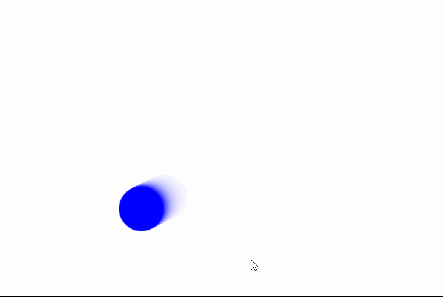
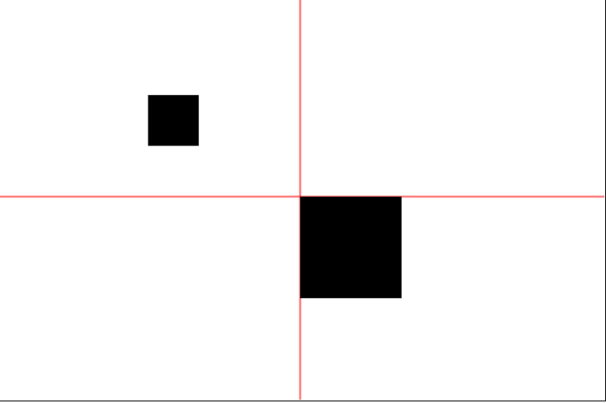
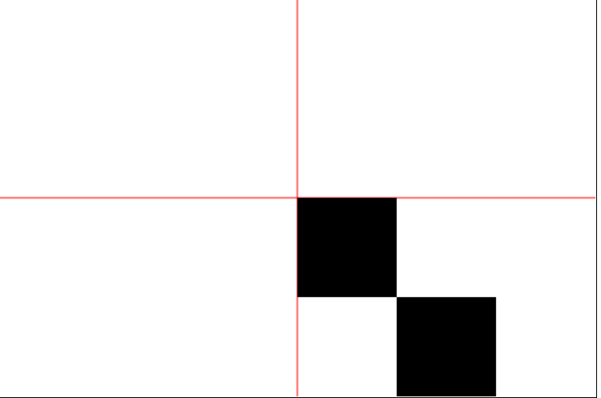
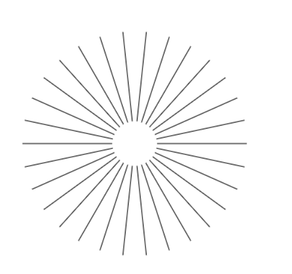
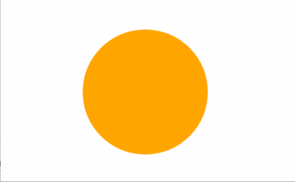
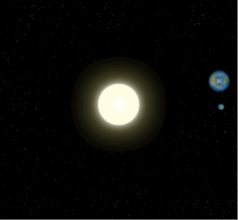
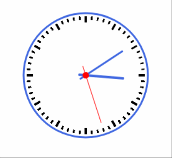

## 动画与变形

### 动画原理

1. 动画的原理，就是一张张画面连续快速播放，当速度超过每秒24张时，人的肉眼就不会分辨出卡顿感。而觉得是在播放连续的视频动画
2. 所以， 我们要实现动画，只需要隔十几毫秒把屏幕清空之后，重新绘制下一帧就可以了

### 执行动画方案

1. 我们可以用window.setInterval(), window.setTimeout(),和window.requestAnimationFrame()来设定定期执行一个指定函数。
2. setInterval(function, delay): 当设定好间隔时间后，function会定期执行。
3. setTimeout(function, delay): 在设定好的时间之后执行函数
4. requestAnimationFrame(callback): 递归调用的形式才实现动画，动画的频率跟随浏览器的刷新频率，效率比较高，连续动画都使用这种方式就可以了

### 弹球动画讲解

1. 先实现绘制某一帧的方法(draw())
    1. 清空canvas
    2. 绘制小球
    3. 更改小球的位置
2. 添加一个动画(window.requesAnimationFrame(draw))
3. 边界处理
    * 如果小球到达边界，修改其速度为反方向；
4. 代码实现

    ```js
    <script>
        var canvas = document.getElementById("canvas");
        var ctx = canvas.getContext("2d");
        ctx.fillStyle = "blue";
        var animation;

        //创建一个圆对象
        var circle = {
            radias: 30,
            x: 0,
            y: 0,
            speedx: 2,
            speedy: 1,
            isRunning: false,

            draw: function () {
                //画一个圆
                ctx.beginPath();
                ctx.arc(this.x, this.y, this.radias, 0, 2*Math.PI);
                ctx.fill();
            }
        };

        function draw() {
            //每一帧，圆的位置都会发生变化
            circle.x += circle.speedx;
            circle.y += circle.speedy;

            //边界判断，到了边界就调头
            if (circle.x == canvas.width-circle.radias || circle.x == circle.radias) {
                circle.speedx = -circle.speedx;
            }

            if (circle.y == canvas.height-circle.radias || circle.y == circle.radias) {
                circle.speedy = -circle.speedy;
            }

            //绘制小球，绘制当前帧，把上一帧的画面清空
            //ctx.clearRect(0, 0, canvas.width, canvas.height);
            ctx.save();
            ctx.fillStyle = "rgba(255,255,255,0.2)";
            //ctx.fillStyle = "red";
            ctx.fillRect(0,0,canvas.width,canvas.height);
            ctx.restore();
            circle.draw();

            //开始执行动画
            animation = window.requestAnimationFrame(draw);
        }

        //添加点击事件，当点击时，如果正在运行，则暂停，如果没有正在运行，则点击动行
        canvas.addEventListener("click", function (e) {
            if (!circle.isRunning) {
                circle.x = e.clientX;
                circle.y = e.clientY;
                animation = window.requestAnimationFrame(draw);
                circle.isRunning = true;
            } else {
                circle.isRunning = false;
                window.cancelAnimationFrame(animation);
            }
        });

    </script>
    ```

    

### 变形

#### 缩放

1. scale是用来缩放画布元素的坐标和宽高。如果一张（100\*100）的画布，scale为（0.5, 0.5），用fillRect(50, 50, 50, 50)来画一个正方形，实际显示效果未缩放前的（25, 25, 25, 25）位置和大小的效果是一样的。

2. 代码与示例
    ```js
    <script>
        var canvas = document.getElementById("canvas");
        var ctx = canvas.getContext("2d");

        //设置画笔的粗细和颜色
        ctx.lineWidth = 1;
        ctx.strokeStyle = "red";

        //1. 将画笔移动到某个点
        ctx.moveTo(0, 200);
        //2. 从上面这个点开始，划一条直接到某一个点
        ctx.lineTo(600, 200);

        ctx.moveTo(300, 0);
        ctx.lineTo(300, 400);
        //3. 填充颜色
        ctx.stroke();

        ctx.fillRect(300, 200, 100, 100);

        ctx.scale(0.5, 0.5);
        ctx.fillRect(300, 200, 100, 100);
    </script>
    ```
    

#### 平移

1. 平移就是改变往水平或垂直方向，改变参考原点的值。translate(100, 100);就是绘图时，在当前参考原点的基本之上，向右平移100像素，向下平移100像素。
2. 代码与示例

    ```js
    <script>
        var canvas = document.getElementById("canvas");
        var ctx = canvas.getContext("2d");

        //设置画笔的粗细和颜色
        ctx.lineWidth = 1;
        ctx.strokeStyle = "red";

        //1. 将画笔移动到某个点
        ctx.moveTo(0, 200);
        //2. 从上面这个点开始，划一条直接到某一个点
        ctx.lineTo(600, 200);

        ctx.moveTo(300, 0);
        ctx.lineTo(300, 400);
        //3. 填充颜色
        ctx.stroke();

        ctx.fillRect(300, 200, 100, 100);

        ctx.translate(100, 100);
        ctx.fillRect(300, 200, 100, 100);
    </script>
    ```

    

#### 旋转

1. 旋转，就是围绕当前的原点，坐标系发生旋转。
2. 代码与示例

    ```js
    <script>
        var canvas = document.getElementById("canvas");
        var ctx = canvas.getContext("2d");

        ctx.save();
        ctx.translate(200, 200);

        //画30条直线，角度不一样
        for (var i=0; i<30; i++) {
            ctx.rotate(1/15*Math.PI);
            ctx.beginPath();
            ctx.moveTo(30, 0);
            ctx.lineTo(150, 0);
            ctx.stroke();
        }

        ctx.restore();

    </script>
    ```

    

> 缩放， 平移和旋转，都属性ctx画图工具的属性，像画笔和颜色一样，是可以做save和restore操作的。

### 圆形进度条的实现

* 示例（参考上课源码）

    

### 地球围绕太阳转示例讲解

* 示例（参考上课源码）

    


### 时钟示例讲解

* 示例（参考上课源码）

    
